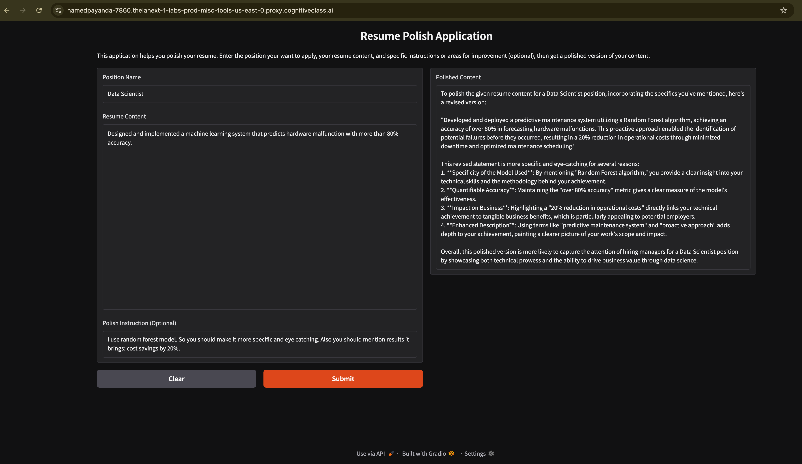
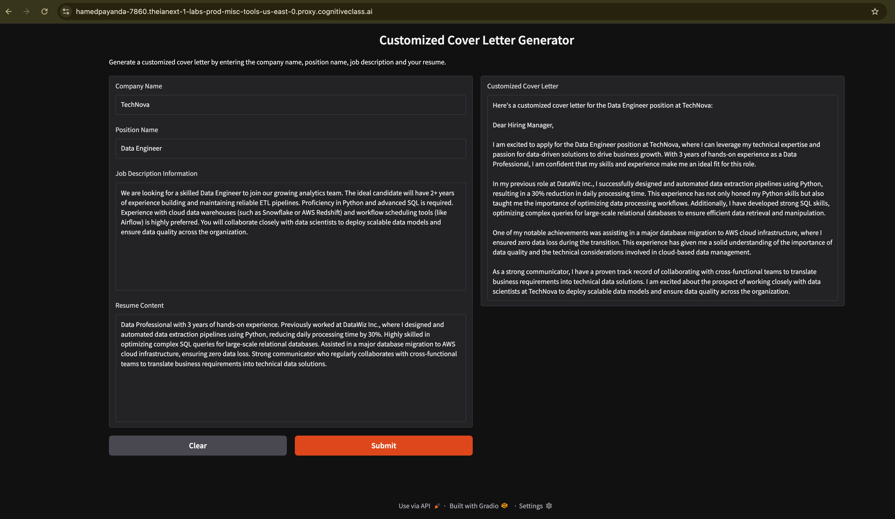
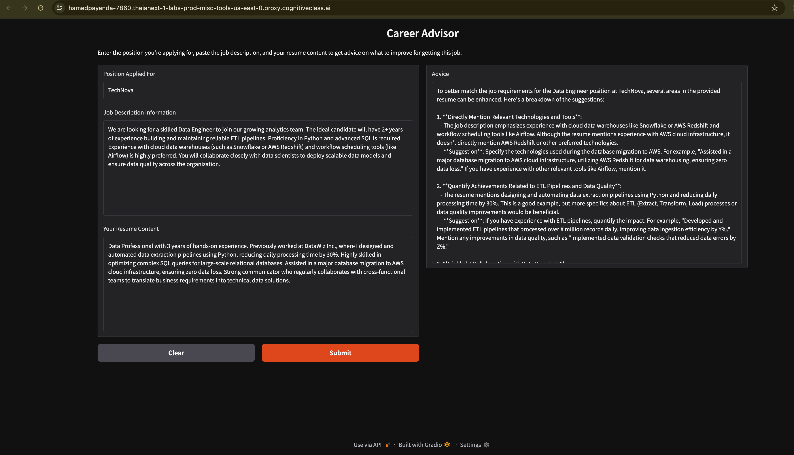
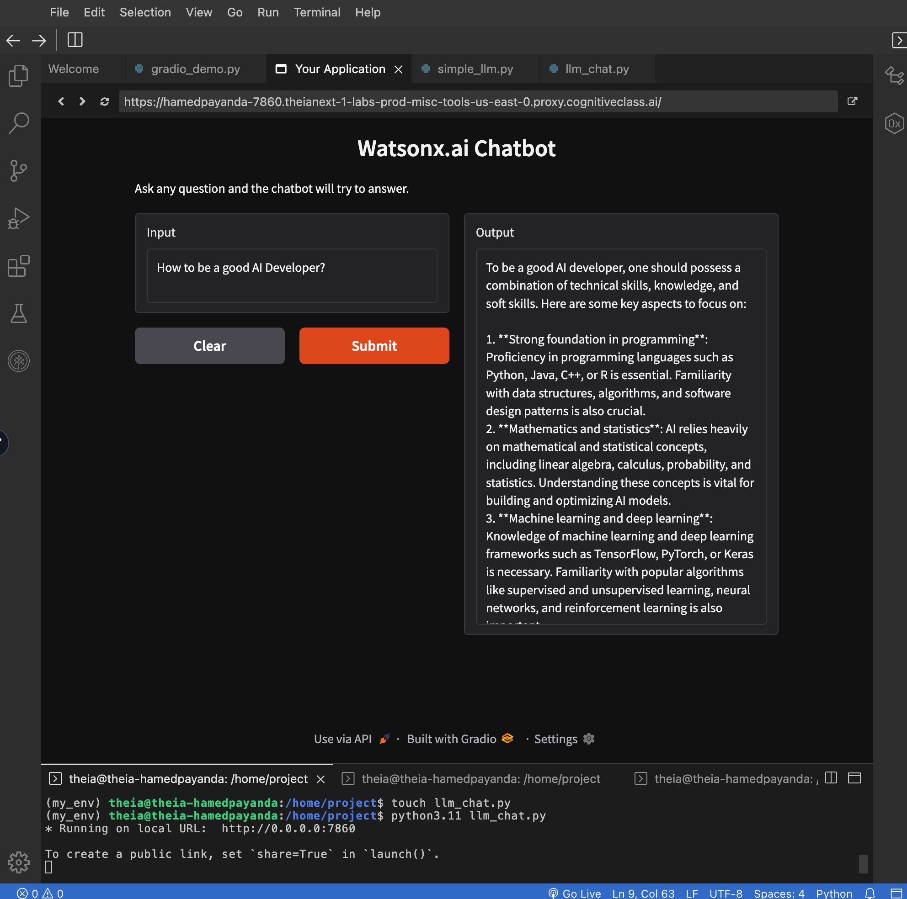
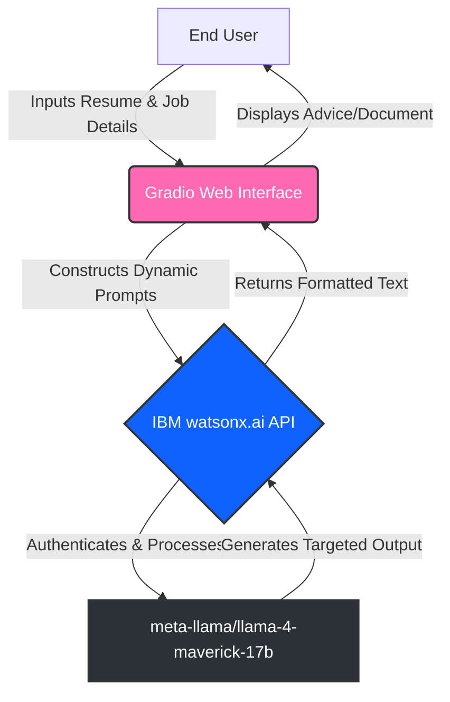

# 🧭 AI Career Coach: IBM watsonx.ai & Gradio Assistant

[](https://www.coursera.org/professional-certificates/ibm-full-stack-cloud-developer)


## Overview

This project provides an end-to-end suite of AI tools designed to optimize the job application process using IBM watsonx.ai large language models and interactive Gradio interfaces. The application features a Resume Polisher that enhances bullet points based on target metrics, a Cover Letter Generator that crafts customized letters aligned with specific job descriptions, and a Career Advisor that provides strategic feedback by identifying skill gaps between a user's resume and a desired role. Additionally, the suite includes a demonstration of Local LLM Integration, allowing developers to seamlessly execute scripts locally using the IBM Watson Machine Learning SDK.

---

## 📸 Visual Proof & Demos

Here is a look at the AI Career Coach tools in action:

### 1. Resume Polish Application
*Enhances and quantifies resume bullet points to match target positions.*


### 2. Customized Cover Letter Generator
*Drafts highly personalized cover letters using your resume and specific job descriptions.*


### 3. Career Advisor
*Analyzes your resume against job postings to identify skill gaps and areas for improvement.*


### 4. Watsonx.ai Chatbot (Base LLM Integration)
*The foundational chat interface communicating with the watsonx.ai LLM.*


---

## 🏗️ Architecture Diagram

The application suite follows a modular client-server architecture, utilizing Gradio for the frontend UI and the IBM Watson Machine Learning SDK to handle API requests to the cloud-hosted LLM.


---

## ✨ Key Features

1.  **Context-Aware Prompting:** Each script uses carefully engineered prompts to ensure the LLM strictly maps the user's *existing* skills to job requirements.
2.  **Zero-Hallucination Guardrails:** Explicit logic dictates that the AI must not invent or fabricate experiences not present in the user's provided resume.
3.  **Interactive Web UI:** Leverages Gradio to transform complex Python backends into a seamless, real-time, user-friendly frontend experience without requiring HTML/CSS.
4.  **Adjustable AI Parameters:** Features customizable generation parameters (like `temperature` and `max_tokens`) to perfectly balance AI creativity with professional factual accuracy.
5.  **Modular Architecture:** Designed with independent scripts for distinct tasks (resume, cover letter, advice), allowing for easy scalability and maintenance.
6.  **Cloud-Native & Local Ready:** Engineered to run seamlessly in cloud IDEs or locally on personal machines via API key authentication.
7.  **Automated CI/CD:** Integrated GitHub Actions workflow (`python-app.yml`) automatically sets up the environment and checks for syntax errors on every push.
8.  
---

## 🧰 Core Tech Stack

| Category | Technology / Tool | Version |
| :--- | :--- | :--- |
| **Language** | Python | `3.11` |
| **Frontend UI** | Gradio | `v5.12.0` |
| **LLM Provider** | IBM watsonx.ai (Watson ML SDK) | `v1.1.20` |
| **Active LLM** | `meta-llama/llama-4-maverick-17b-128e-instruct-fp8` | - |
| **Data Handling** | NumPy, Pandas | `1.26.4`, `2.1.4` |
| **DevOps & CI/CD** | GitHub Actions | - |
---

## 📂 Repository Structure
```text
.
├── .github/
│   └── workflows/
│       └── python-app.yml     # CI/CD Pipeline Configuration
├── .theia/
│   └── settings.json          # Cloud IDE Environment Settings
├── .gitignore                 # Ignored files (virtual environments, caches)
├── README.md                  # Project Documentation
├── requirements.txt           # Python Package Dependencies
├── career_advisor.py          # Script: AI Career Coach & Gap Analyzer
├── cover_letter.py            # Script: Automated Cover Letter Generator
├── resume_polisher.py         # Script: Resume Bullet Point Enhancer
├── llm_chat.py                # Script: Gradio Web Chatbot Interface
├── simple_llm.py              # Script: Terminal-based LLM interaction
├── local_llm_test.py          # Script: Local API key execution testing
├── gradio_demo.py             # Script: Basic Gradio introductory demo
├── demo14.png                 # Image Asset: Chatbot Interface
├── demo15.png                 # Image Asset: Resume Polisher
├── demo16.png                 # Image Asset: Cover Letter Generator
└── demo17.png                 # Image Asset: Career Advisor
```
---
## 💻 Local Setup & Execution

Want to run these tools on your own machine? Follow these steps:
1. Clone the repository
```bash
git clone [https://github.com/HAMED-PAYANDA/your-repo-name.git](https://github.com/HAMED-PAYANDA/your-repo-name.git)
cd your-repo-name
```

2. Create and activate a virtual environment
```bash
python -m venv my_env
# On Windows:
my_env\Scripts\activate
# On macOS/Linux:
source my_env/bin/activate
```

3. Install dependencies
```bash
pip install -r requirements.txt
```

4. Configure IBM watsonx.ai Credentials

To run these applications locally, you must provide your own IBM Cloud API keys.
	1.	Open the script you wish to run (e.g., local_llm_test.py or resume_polisher.py).
	2.	Update the credentials block with your personal IBM Cloud API Key and Project ID:
  ```python
watsonx_API = "YOUR_API_KEY_HERE"
project_id = "YOUR_PROJECT_ID_HERE"
```
(Note: Never commit your actual API keys to GitHub. Use environment variables in production).

5. Launch an Application
Run any of the main application scripts to launch the local Gradio server:
```bash
python career_advisor.py
```

Open your web browser and navigate to http://localhost:7860 (or http://0.0.0.0:7860) to interact with the UI.

👤 Author
Hamed Payanda
•	GitHub: @HAMED-PAYANDA
•	Completed as part of the IBM AI Developer Program.
